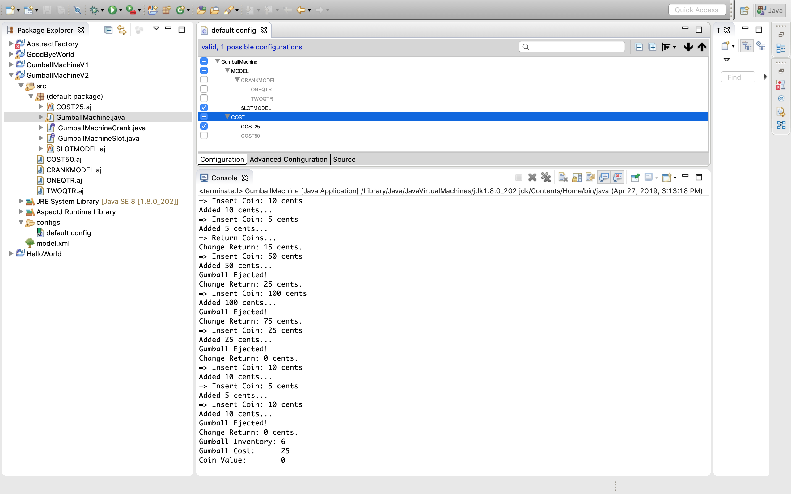
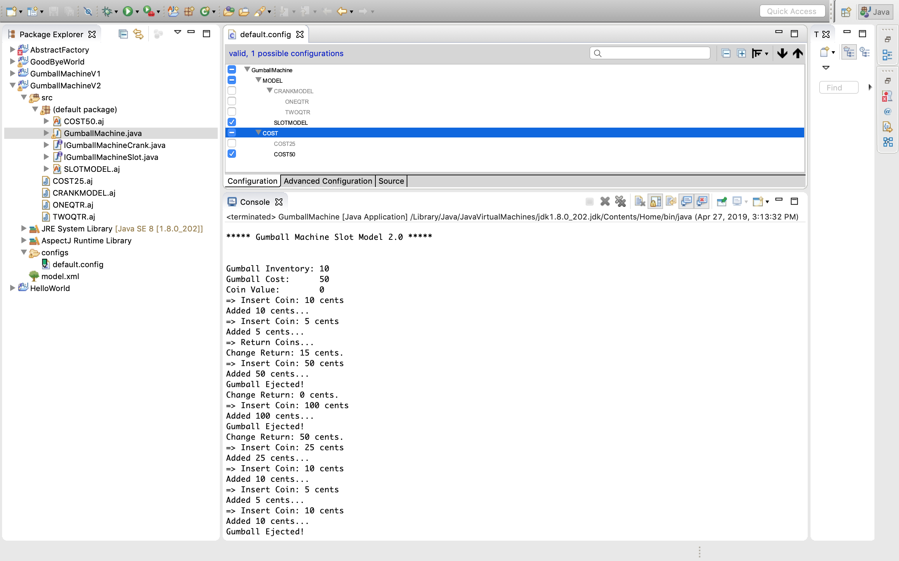
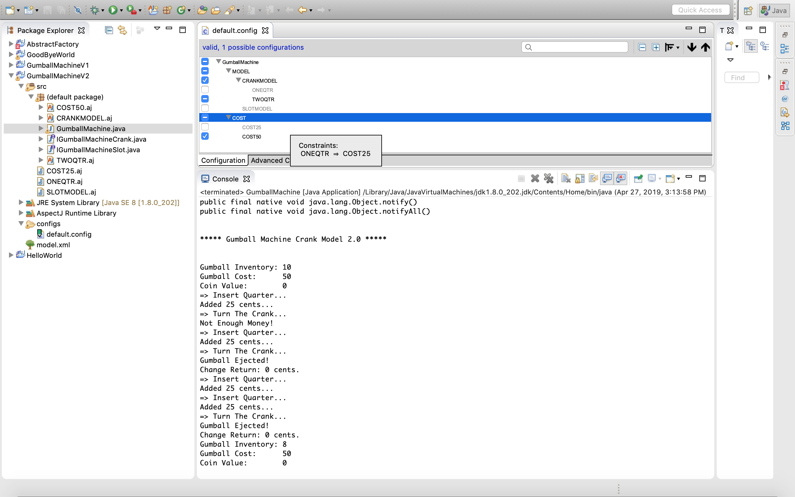
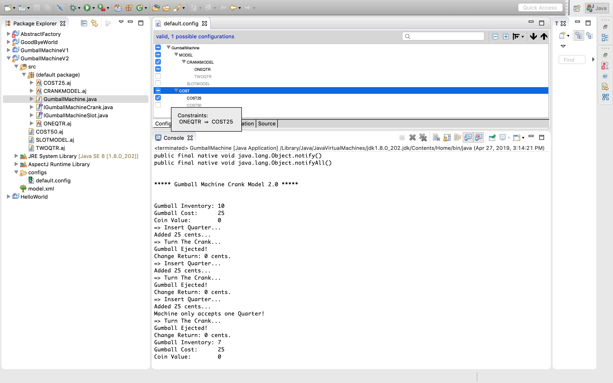

### Lab 1

In lab1, we had 3 different gum ball machines. and in each gumball machines we had to put in number of coins accepted and cost of each gumball machine. This information was provided through constructor either hard coded or by user.

### Lab 10
In lab10, we have same 3 gumball machines but this time, the cost and the accepted coins information is provided in the configuration file. Using features, we decide the configuration ahead ot time, by modifying the xml file and automatically aspectJ takes care of injecting the information to create a gumball machine.

